# Architecutre
 

# Shift layer
 

# Shift-Net
Please refer to our code [Shift-Net_pytorch](https://github.com/Zhaoyi-Yan/Shift-Net_pytorch) based on Pytorch. It is much faster than this repository. As some code in this repository are implemented using `for-loop`, while the code of pytorch version [Shift-Net_pytorch](https://github.com/Zhaoyi-Yan/Shift-Net_pytorch) is fully-implemented parallelly.

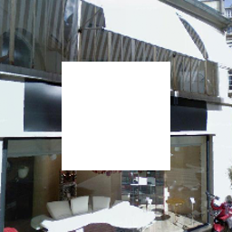 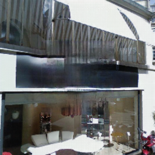
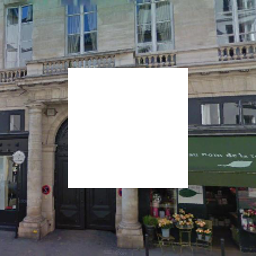 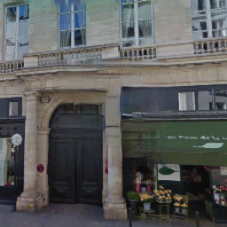
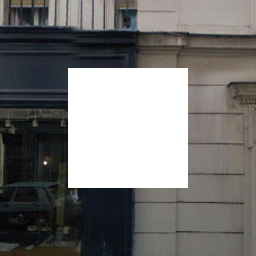 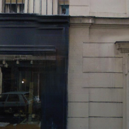
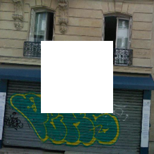 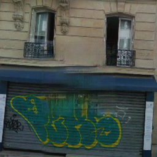
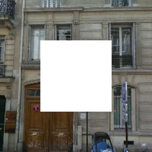 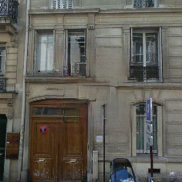
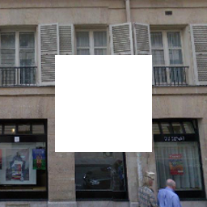 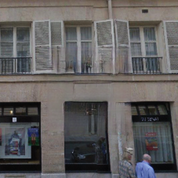
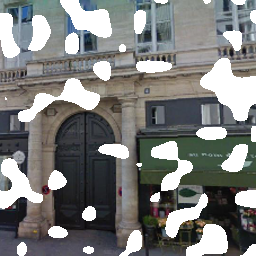 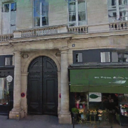
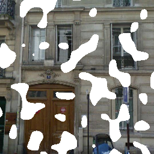 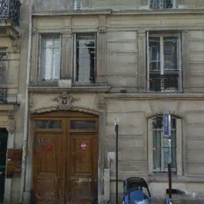
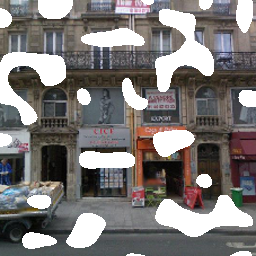 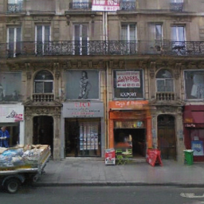
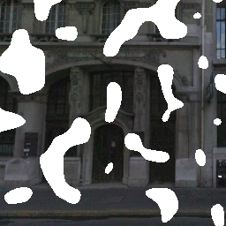 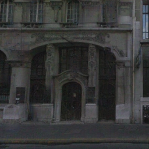

## Getting Started
We expect you have an nvidia GPU and have installed CUDA.
The code does not support running on CPU for now.
### Installation
- Install torch and dependencies from https://github.com/torch/distro
- Install torch packages `nngraph`, `cudnn`, `display`
```bash
luarocks install nngraph
luarocks install cudnn
luarocks install https://raw.githubusercontent.com/szym/display/master/display-scm-0.rockspec
```
- Clone this repo:
```bash
git clone https://github.com/Zhaoyi-Yan/Shift-Net
cd Shift-Net
```

### Download pre-trained model
```bash
bash  scripts/download_models.sh
```
The model will be downloaded and unzipped.
If you cannot have access to OneDrive, then you can try [BaiduCloud](https://pan.baidu.com/s/14r-TLhW2PVor-d_uhpHFjQ) to download our model.

### Train
- Download your own dataset.

- Change the options in `train.lua` according to your path of dataset.
Normally, you should at least specify three options.
They are `DATA_ROOT`, `phase` and `name`.

For example:

`DATA_ROOT`: `./datasets/Paris_StreetView_Dataset/`

`phase`:     `paris_train`

`name`:      `paris_train_shiftNet`

This means that the training images are under the folder of `./datasets/Paris_StreetView_Dataset/paris_train/`.
As for `name`, it gives your experiment a name, e.g., `paris_train_shiftNet`. When training, the checkpoints are stored under the folder
`./checkpoints/paris_train_shiftNet/`.


- Train a model:
```bash
th train.lua
```

- Display the temporary results on the browser.
Set `display = 1`, and then open another console, 
```bash
th -ldisplay.start
```
- Open this URL in your browser: [http://localhost:8000](http://localhost:8000)

- If you want to train a model that can handle random mask inpainting, then set

`mask_type`: `'random'`

`fixed_mask`: `false`

You can set a float number to `res`, e.g., `local res = 0.06`, the lower it is, the more continuous the output will be.
When test the model, these two options should keep consistent with those that you model are trained with.

### Test
Before test, you should change `DATA_ROOT`, `phase`, `name`, `checkpoint_dir` and `which_epoch`.
For example, if you want to test the 30-th epoch of your trained model, then

`DATA_ROOT`:    `./datasets/Paris_StreetView_Dataset/`

`phase`:        `paris_train`

`name`:         `paris_train_shiftNet`

`checkpoint_dir`:`./checkpoints/`

`which_epoch`: `'30'`

The first two options determine where the dataset is, and the rest define the folder where the model is stored.
- Finally, test the model:
```bash
th test.lua
```
If you find this paper useful, please cite:
```
@InProceedings{Yan_2018_Shift,
author = {Yan, Zhaoyi and Li, Xiaoming and Li, Mu and Zuo, Wangmeng and Shan, Shiguang},
title = {Shift-Net: Image Inpainting via Deep Feature Rearrangement},
booktitle = {The European Conference on Computer Vision (ECCV)},
month = {September},
year = {2018}
}
```

## Acknowledgments
We benefit a lot from [pix2pix](https://github.com/phillipi/pix2pix) and [DCGAN](https://github.com/soumith/dcgan.torch). The data loader is modified from [pix2pix](https://github.com/phillipi/pix2pix) and the implemetation of Instance Normalization borrows from [Instance Normalization](https://github.com/DmitryUlyanov/texture_nets/blob/master/InstanceNormalization.lua). The shift operation is inspired by [style-swap](https://github.com/rtqichen/style-swap).
